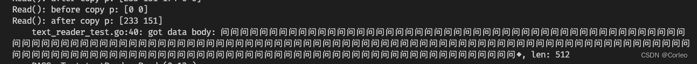

在项目中，需要实现了一个流式的 `io.Reader` 接口，每次 `Read` 返回一个 `rune` 的字节切片，相当于实现流式的效果。后面对其测试，确保有效且不会出现乱码。正常使用 `Read()` 方法是符合预期的，但是，当我使用非流式的方法，也就是 `io.ReadAll(r)` 时，却出现了乱码。

```golang
// text_reader.go
type textReader struct {
	buf bytes.Buffer
}

func NewTextReader(s string) io.Reader {
	return &textReader{
		buf: *bytes.NewBufferString(s),
	}
}

func (r *textReader) Read(p []byte) (n int, err error) {
	if len(p) == 0 {
		return 0, nil
	}
	text, _, err := r.buf.ReadRune()
	if err != nil {
		return 0, err
	}
	b := make([]byte, 4)
	n = utf8.EncodeRune(b, text)
	return copy(p, b[:n]), err
}
```

``` go
// text_reader_test.go
var text string
func Test_textReader_Read(t *testing.T) {
	t.Run("", func(t *testing.T) {
		r := NewTextReader(text)
		tl := 0
		for {
			buf := make([]byte, 64)
			l, err := r.Read(buf)
			t.Logf("got data len: %d, body: %s, err: %v", l, string(buf[:l]), err)
			tl += l
			if err == io.EOF {
				break
			}
			if err != nil {
				t.Errorf("got error: %v", err)
			}
		}
		t.Log("got total len: ", tl)
	})
	t.Run("", func(t *testing.T) {
		r := NewTextReader(text)
		buf, err := io.ReadAll(r)
		t.Logf("got data body: %s, len: %d", string(buf), len(buf))
		if err != nil && err != io.EOF {
			t.Errorf("got error: %v", err)
		}
	})
}
```

后面深入到 `io.ReadAll` 源码中，发现 `io.ReadAll` 的实现并不长，并且会在一开始初始化一个长度为 512 的字节切片。

```go
func ReadAll(r Reader) ([]byte, error) {
	b := make([]byte, 0, 512)
	for {
		if len(b) == cap(b) {
			// Add more capacity (let append pick how much).
			b = append(b, 0)[:len(b)]
		}
		n, err := r.Read(b[len(b):cap(b)])
		b = b[:len(b)+n]
		if err != nil {
			if err == EOF {
				err = nil
			}
			return b, err
		}
	}
}
```

遇到这种必现的问题，一般首先是将 Case 尽可能简化。后面的现象就是当初始化 `textReader` 的字符串长度足够小时， `io.ReadAll` 就不会出现乱码。然后不免让人想到长度是否和 `io.ReadAll` 中初始化长度的 512 相关，后面使用 171 个相同的汉字组成的字符串，作为输入，字节总长度为 513。果然在最后就出现了乱码：



并且返回的长度为 512，从日志可以看出来，`io.ReadAll()` 最后一次调用 `textReader.Read()` 时，`p` 的长度只有 2 ，因此一个 3 字节的汉字被截断成乱码了。因此问题定位出来了：

**`textReader.Read()` 在 `copy` 之前并没有去检查 `p` 的大小，导致一个3字节的汉字被截断**

那么是我实现的 `io.Reader` 这个接口不符合规范吗？我在 `copy(p, b[:n])` 之前应该要对 `p` 进行扩容操作吗？OK，看下 `io.Reader` 的接口定义

> // Reader is the interface that wraps the basic Read method.
> //
> // **Read reads up to len(p) bytes into p.** It returns the number of bytes
> // read (0 <= n <= len(p)) and any error encountered. Even if Read
> // returns n < len(p), it may use all of p as scratch space during the call.
> // If some data is available but not len(p) bytes, Read conventionally
> // returns what is available instead of waiting for more.

`io.Reader` 接口要求最多读取 `len(p)` 个字节，这么看来，确实是 `textReader.Read()` 实现的不合理，另外 `io.Reader` 还规定了其他的行为，详情可以看 `io.Reader` 的注视。因此正确的 `textReader.Read()` 应该是这样：

```go 
type textReader struct {
	buf []byte
	src bytes.Buffer
}

func NewTextReader(s string) io.Reader {
	return &textReader{
		src: *bytes.NewBufferString(s),
		buf: make([]byte, 0, 4),
	}
}

func (r *textReader) Read(p []byte) (n int, err error) {
	if len(p) == 0 {
		return 0, nil
	}
	if len(r.buf) > 0 {
		copy(p, r.buf[:1])
		r.buf = r.buf[1:]
		return 1, nil
	}
	text, _, err := r.src.ReadRune()
	if err != nil {
		return 0, err
	}
	b := make([]byte, 4)
	n = utf8.EncodeRune(b, text)
	if n > len(p) {
		r.buf = append(r.buf, b[len(p):n]...)
		n = len(p)
	}
	return copy(p, b[:n]), err
}
```

上面使用了 `[]byte` 来存储被截断的字符，并且在 `copy` 的时候检查 `len(p)`，并将被截断的剩余字节放入 `buf` 中，等待下一次 `Read()` 的调用。当然这个地方 `buf` 只是一个 FIFO （先进先出）的队列，并且可以保证的是长度不会超过 4 ，因此完全可以使用一个循环数组来优化：

```go
package main

import (
	"bytes"
	"io"
	"unicode/utf8"
)

type textReader struct {
	buf circleQueue
	src bytes.Buffer
}

func NewTextReader(s string) io.Reader {
	return &textReader{
		src: *bytes.NewBufferString(s),
	}
}

func (r *textReader) Read(p []byte) (n int, err error) {
	if len(p) == 0 {
		return 0, nil
	}
	if b, err := r.buf.ReadByte(); err == nil {
		p[0] = b
		return 1, nil
	}
	text, _, err := r.src.ReadRune()
	if err != nil {
		return 0, err
	}
	b := make([]byte, 4)
	n = utf8.EncodeRune(b, text)
	if n > len(p) {
		for i := len(p); i < n; i++ {
			r.buf.WriteByte(b[i])
		}
		n = len(p)
	}
	return copy(p, b[:n]), err
}

type circleQueue struct {
	buf  [8]byte
	head int
	tail int
}

func (q *circleQueue) ReadByte() (byte, error) {
	if q.head == q.tail {
		return 0, io.EOF
	}
	b := q.buf[q.head]
	q.head++
	if q.head >= 8 {
		q.head = 0
	}
	return b, nil
}

func (q *circleQueue) WriteByte(b byte) {
	q.buf[q.tail] = b
	q.tail++
	if q.tail >= 8 {
		q.tail = 0
	}
}
```

至此，我们就解决了这个看似合理的 `io.Reader` 接口在使用 `io.ReadAll()` 时出现乱码的 BUG，原因在于 `io.Reader` 并没有按照规定去实现 `Read(io.Reader)(int, error)` 方法。
